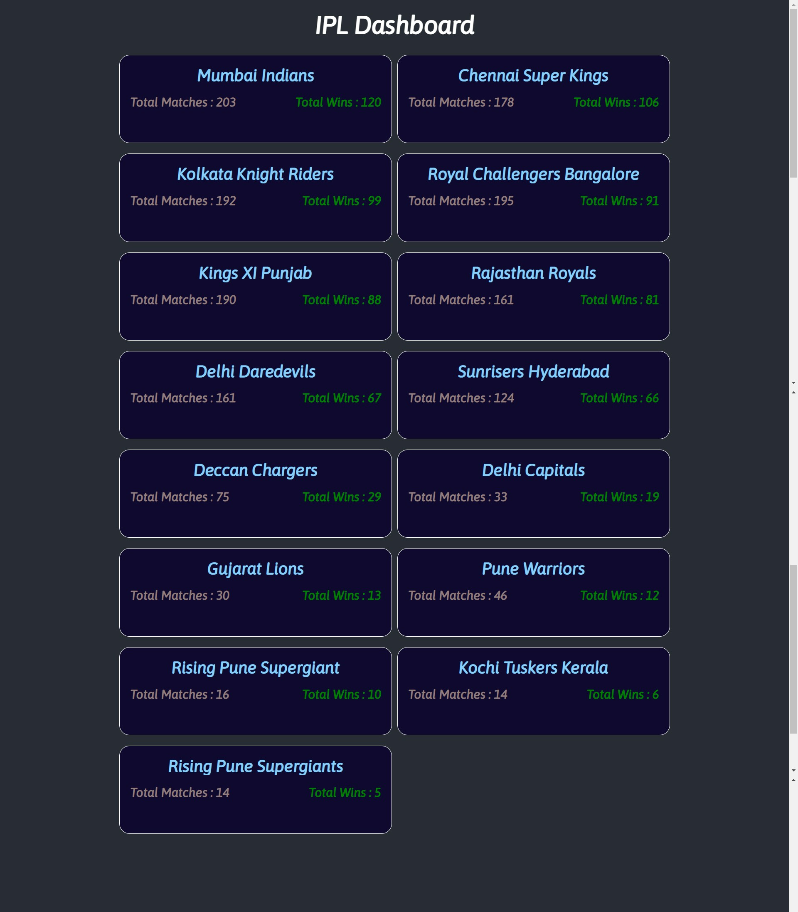
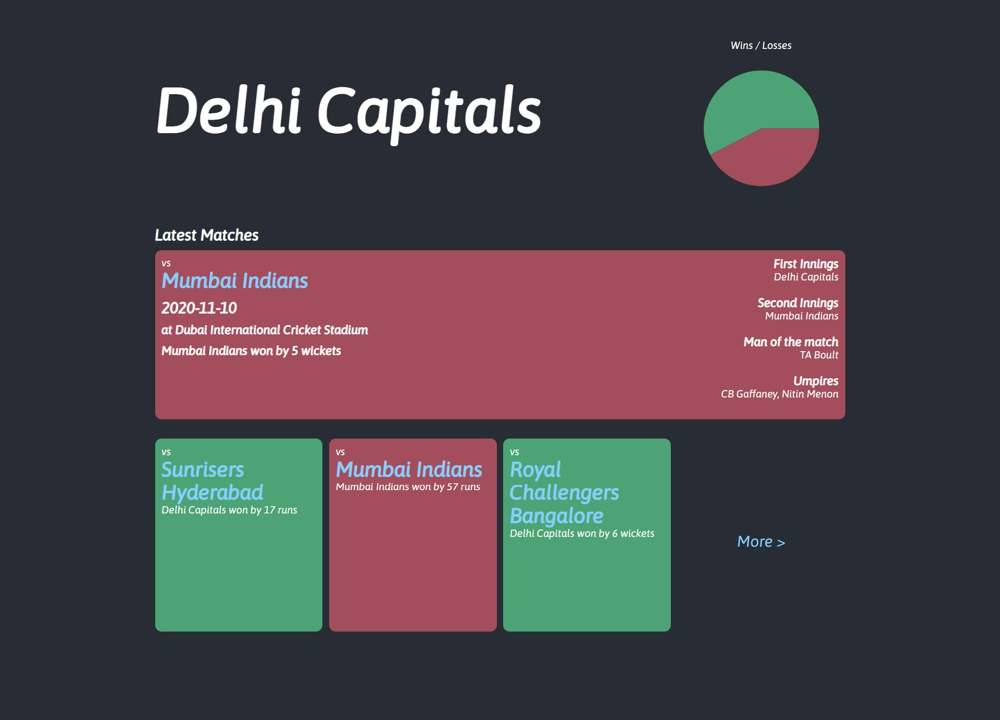
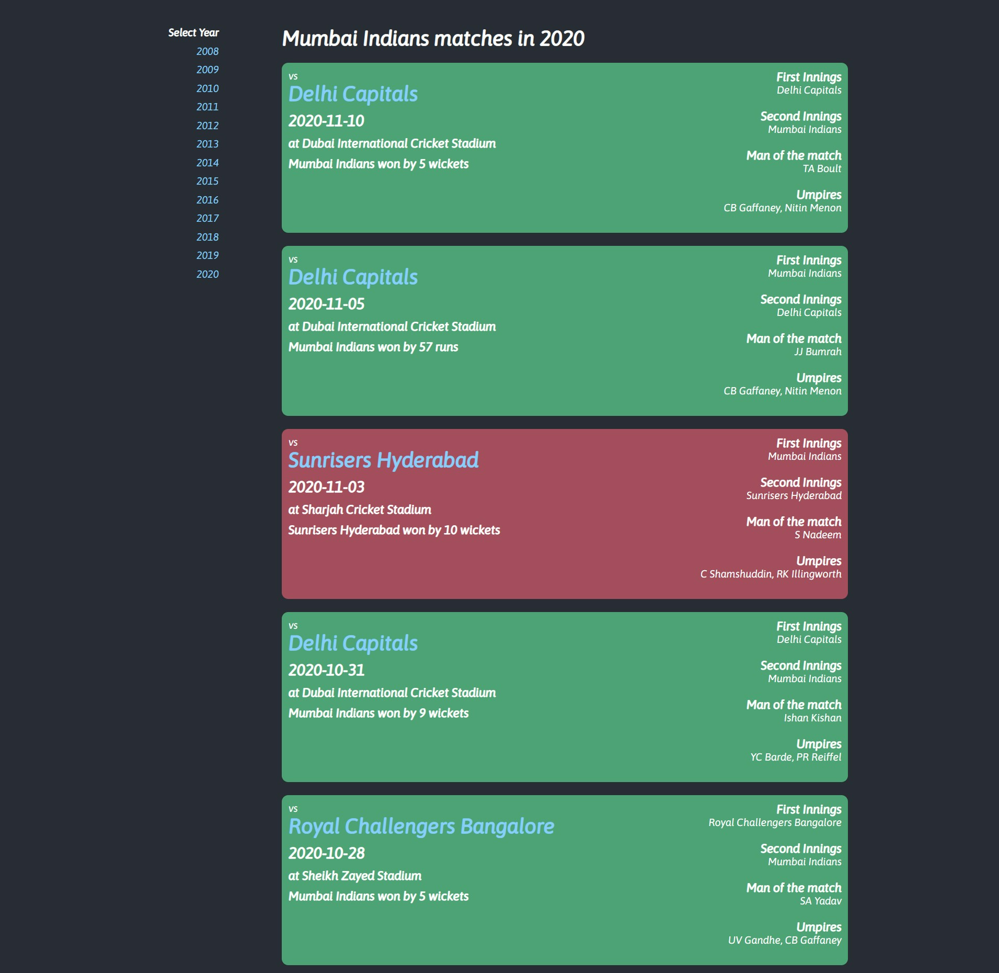

# IPL Dashboard

### Data Set Used

https://www.kaggle.com/patrickb1912/ipl-complete-dataset-20082020/metadata

### Technologies

- Spring Boot
- Spring Batch Processing
- Java Persistence API, Repositories and JPQL
- React Js
- H2 Database

### Steps to run the application loaclly

1. Navigate to the back-end folder and execute the following command

```properties
mvnw spring-boot:run
```

2. make a request to Homepage http://localhost:8080

#### or

1. Do a maven build from the back-end folder

```properties
mvnw clean install
```

2. run the jar file from the back-end/target folder

```properties
java -jar ipl-dashboard-1.0.jar
```

3. make a request to Homepage http://localhost:8080

## HomePage



## TeamPage



## MatchPage


